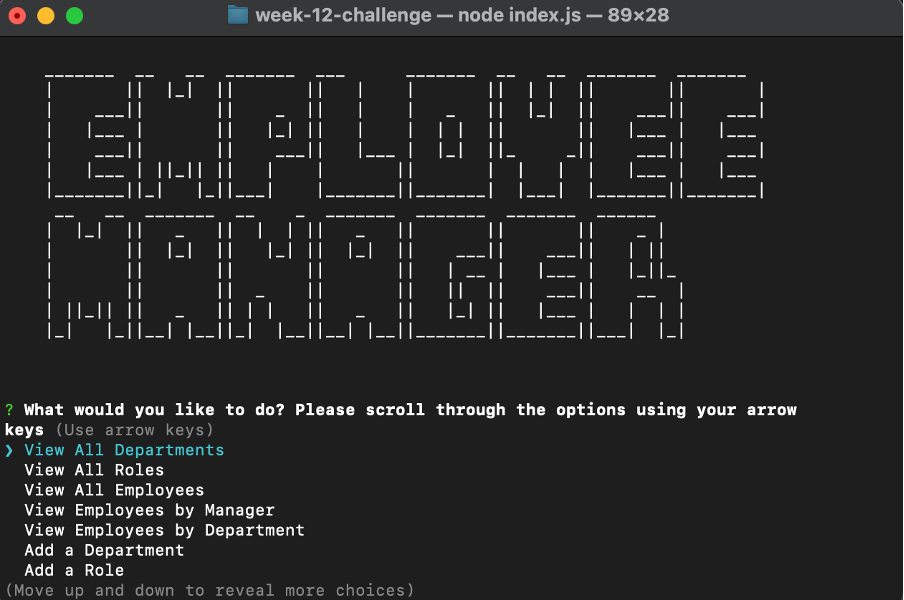

# Week 12 Challenge - Employee Tracker Application

## Task Description

This week our task was to create a node js application that utilised SQL queries to create and manage an employee database. Multiple various queries were implemented throughout the application, such as - Creating new employees, roles, departments, as well as updating and deleting these items.

## Usage

In order to run the application please run
`node index.js`

## Image of Working Application

